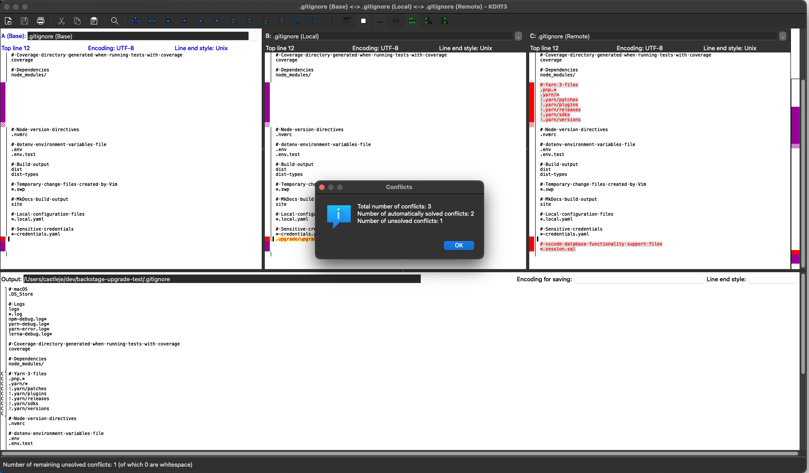
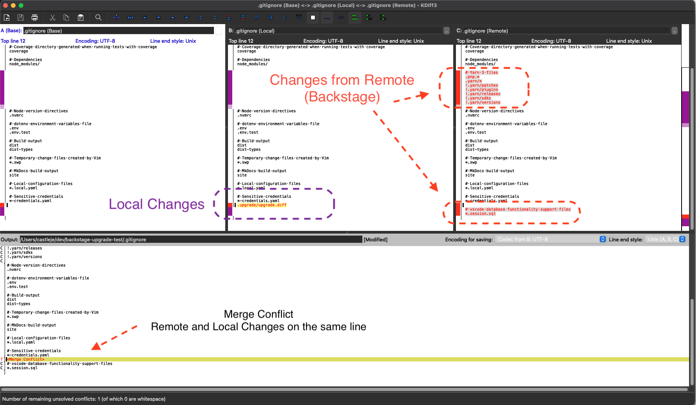
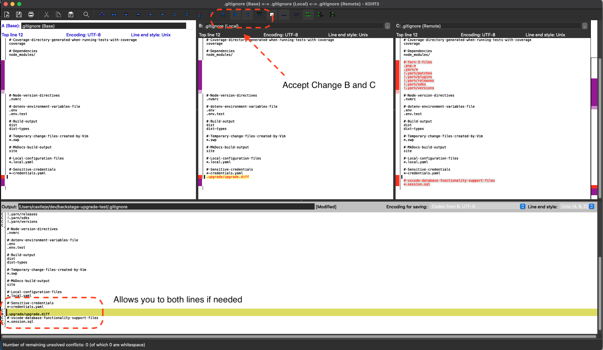
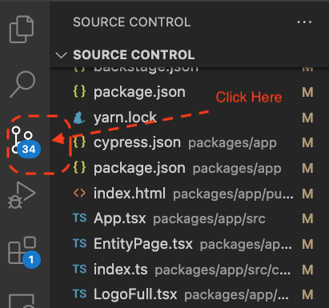
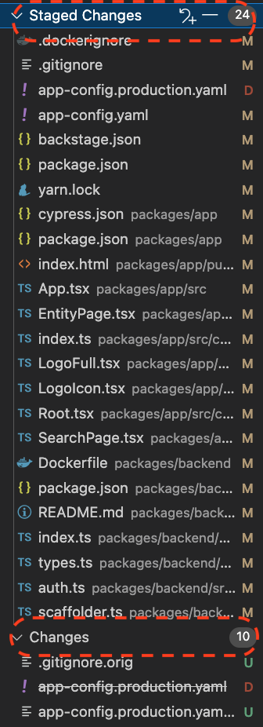
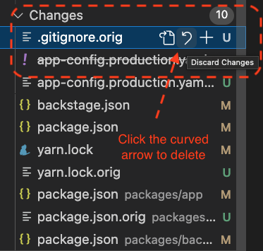
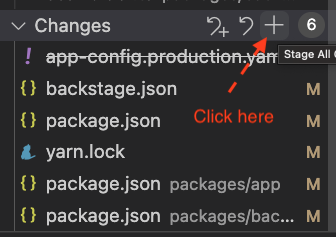
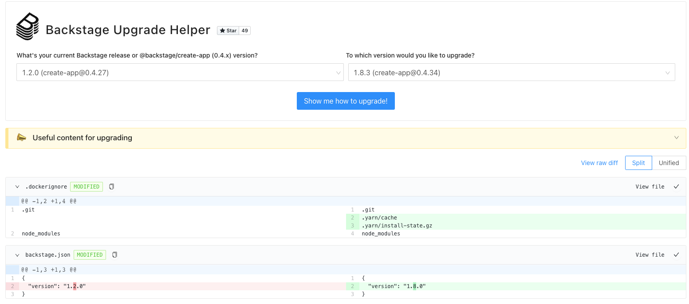
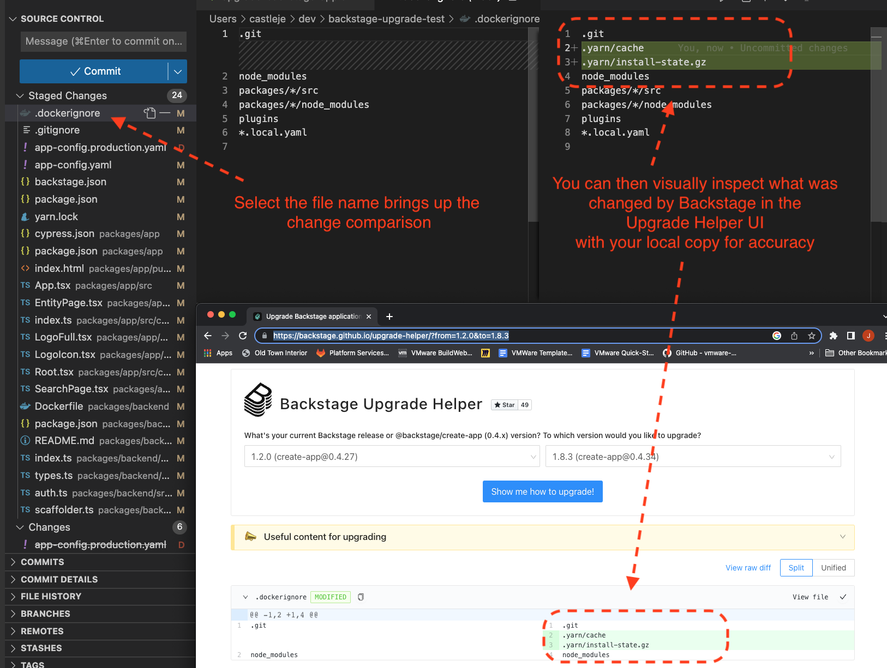
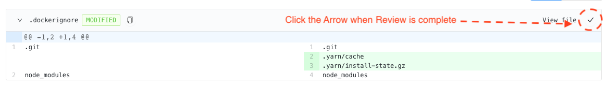

# Upgrade Backstage

This document will walk you through an approach to upgrading Backstage using a bash script with git merge tools within a Dev branch.

## Prerequisites

There are a few development tools you’ll need to have installed on your computer to get started with Backstage (```Node```, ```Yarn```, ```Docker```, ```Git```, etc.). You can find a summary on the Learning Backstage site:

* [Backstage Prerequisites](https://backstage.spotify.com/learn/standing-up-backstage/)

The script used for upgrades also requires that ```jq``` and ```kdiff3``` are installed locally:

* [Install jq](https://formulae.brew.sh/formula/jq)
* [Install kdiff3](https://formulae.brew.sh/cask/kdiff3)

## Learn about Backstage Upgrades

Before you attempt upgrading Backstage it is recommended to become familiar with the process and tools. These are 

* [Keeping Backstage Updated](https://backstage.io/docs/getting-started/keeping-backstage-updated)
* [Overview of the Backstate Upgrade Helper](https://backstage.spotify.com/blog/avoid-upgrade-surprises-with-backstage-upgrade-helper/)
* [Link to Backstate Upgrade Helper](https://backstage.github.io/upgrade-helper/)
* [Github Discussion on Upgrading Backstage](https://github.com/backstage/backstage/discussions/4989)

## Overview of the Upgrade Script

A script has been created that will help automate part of the Backstage Upgrade. Find ```upgrade-backstage-app.sh``` in the root of the project.

Executing this script will perform the following tasks:

* Check the existance of ```jq```, ```yarn```, ```node```, and ```kdiff3```. These are all needed for the script to run. 
* Compare your current version of Backstage with the latest version available from Spotify. If there is no upgrade available then the script will stop and indicate your version of Backstage is up to date.
* Create an app-config.production.yaml and stage this in git. The McKesson version of Backstage has removed this file, but the file is temporarily needed for the merge to work from Backstage.
* It will fetch all the changes from the Backstage remote repository and pull then into your local git branch and build a patch file named ```upgrade.diff```. This contains all the changes made to the files by Spotify.
* Attempts to apply the changes to your local copy of Backstage.
* Will kick off a merge tool if conflicts are found and allow you to use the merge tool to resolve the conflicts.
* It will use the ```yarn backstage-cli versions:bump``` command to update the installed Backstage Plugins to the latest versions available. 

**The script places your local copy of Backstage in a state where you can then manually build the application and test it. It will not complete the merge or upgrade.**

## Upgrading Backage 

### 1. Preparing the Upgrade Environment

* Use a branching within Git to execute the script. 
```
git checkout -b upgrading-backstage
```

* Make sure you have no changes in your local environment. This can cause issues with the upgrade script when it executes. Running a ```git status``` is a good way to check for any changes. 

### 2. Executing the Script 

The ```upgrade-backstage-app.sh``` script should be in the root of the Backstage project. You can start the upgrade process by executing the shell script from the command prompt.

```
> ./upgrade-backstage-app.sh   
```

The script will start with checks for prerequisite software installed and then attempt to build a patch file to apply to the repo. Here's an example run where merge conflicts are found:

```
Applied patch packages/backend/src/types.ts cleanly.
Applied patch yarn.lock cleanly.
U .gitignore
U app-config.production.yaml
U packages/app/package.json
U yarn.lock

Kick off git merge tool

Merging:
.gitignore
app-config.production.yaml
packages/app/package.json
yarn.lock

Normal merge conflict for '.gitignore':
  {local}: modified file
  {remote}: modified file
```


### 3. Using KDiff3 to Merge

If merge conflicts are found the script will automatically open ```kdiff3``` to resolve the merge conflicts.



KDiff3 will open with three top windows.

* Window B will have your local copy. This will include custom code if added.
* Window C will have the remote copy that is being pulled in from the latest version of Backstage.

Merged code will be displayed on the bottom window. You can select what code you want to merge by using the A, B, and/or C buttons on the top toolbar of Kdiff3. The example below shows a merge conflict with Window B and C. We want to accept both as Window B has custom code and Window C has changes that Backstage has made in their latest version. 



The example below demonstrates an output of a merge.



When you are done merging changes then use the Save button in KDiff3 to persist your changes and close the window. The next merge conflict found will open a new Kdiff3 window to allow you to resolve those conflicts. 

Resolving all merge conflicts found in each file will result in the script moving on to the next step of the script that will upgrade the Backstage plugin versions to the versions of the latest release.

All files that are merged will be staged in git automatically

### 4. Bumping Plugin Versions

The script will next run a ```yarn install``` to pull the dependencies for Backstage and attempt to run a ```yarn backstage-cli bump:versions``` to update the plugins in the ```package.json``` files to the latest plugin versions. 

Plugin version changes may or may not have breaking changes. It's best to review the script for any breaking changes message as you may have custom code that needs to be updated because of the breaking changes. Example:

```
⚠️  The following packages may have breaking changes:

  @backstage/backend-common : 0.13.5 ~> 0.16.0
    https://github.com/backstage/backstage/blob/master/packages/backend-common/CHANGELOG.md
```

Bumping plugin versions will NOT result in changes being staged in Git.

### 5. Verify the Upgrade

When the script is completed it is now time to use the Backstage Upgrade Helper and VSCode to visually inspect the changes and verify the upgrade was successfully merged into your local copy of Backstage. It's best to review the [Backstage Releases](https://github.com/backstage/backstage/releases) and any Plugin CHANGELOG's as you verify to understand what Backstage has changed.

The script generates a link to the Backstage Upgrade Helper with the current and target versions. Example:

* https://backstage.github.io/upgrade-helper/?from=1.2.0&to=1.8.3 

This page is useful for comparing what has changed by Backstage between versions and can be used to help you verify your Backstage upgrade.

Using VSCode is an easy way to sort through the changes. Click the Source Control icon on the left toolbar to open the Source Control View



You should now see a list of Staged Changes and Changes: 



We first want to remove all .orig files from the changes list that were generated from kdiff3. These are temporary files that do not need to be source controlled.



The next step is to stage all the remaining changes in Git.



We are now ready to use the Upgrade Helper Tool to inspect all staged changes to accuracy.




You can use the Backstage Upgrade Helper to visually inspect the changes that Backstage has made between versions with what has been changed in your local copy for accuracy of the upgrade.



Once you have inspected the change in a file you can click the check mark next to View file in the Backstage Upgrade Helper UI to indicate you've review that file.



Repeat the above process of clicking a staged change in VSCode to see the changes and comparing it within the Backstage Upgrade Helper UI for accuracy and mark it off as reviewed until you've inspected each staged changed. 

### 6. Testing the Application

The final step before completing the upgrade is to build and test your upgraded version of Backstage locally. Running the following yarn commands will pull the latest dependencies, run the type script compiler, and then run the build command.

```
yarn install && yarn tsc && yarn build:all
```

There may be breaking changes that are found as part of this step and you will need to use the Backstage Change Logs to understand what was breaking and how to fix your custom code.

It's now time to bring up Backstate locally. Running a ```yarn dev``` will bring up a browser on ```localhost:3000``` and you should see the Backstage login page.

### 7. Completing the Upgrade

Once the upgrade is completed and you can see the Backstage login page it's time to commit your changes and push them to your remote branch and open a PR to merge into main.

```
git commit -m "Upgraded Backstage from Version 1.2.0 to latest 1.8.3 release"
git push
```

Once the changes are pushed to the remote location and the PR is accepted this will kick off the github actions to build and deploy Starship to a Dev Cluster and then you can your tests to make sure Backstage is working properly in Dev.